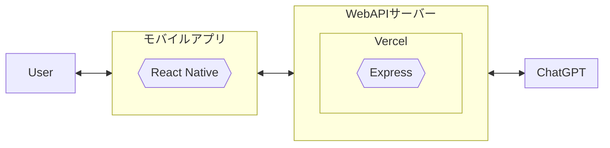

# 説明

アプリ名「RAY-BOON」

例文を ChatGPT の API キーを使用して生成できる単語帳アプリ

# Google Play Store

https://play.google.com/store/apps/details?id=com.rayboon

# Canva

https://www.canva.com/design/DAFkZTCS_hw/PTxL2zHqkzewD535AFJS2w/view?utm_content=DAFkZTCS_hw&utm_campaign=designshare&utm_medium=link&utm_source=publishsharelink

# システム構成

